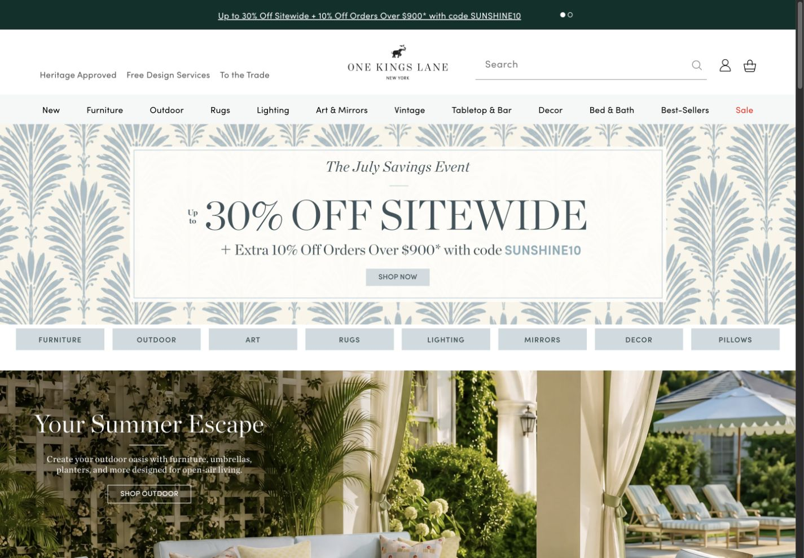
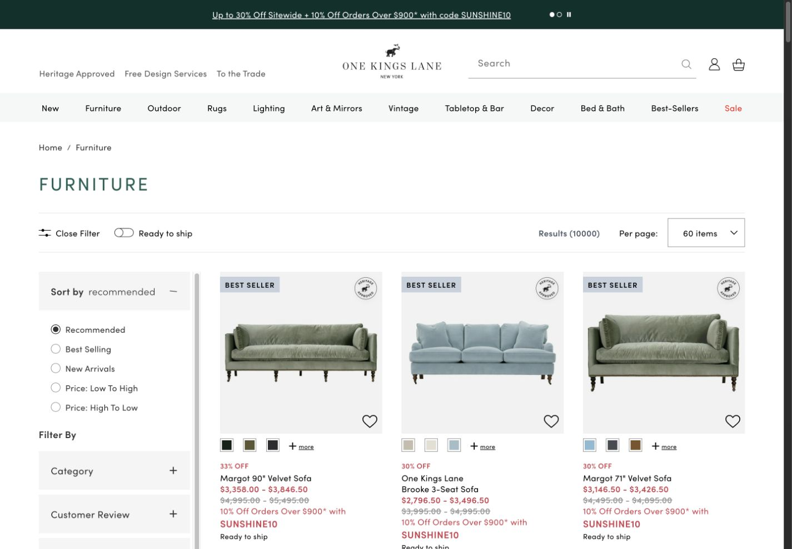
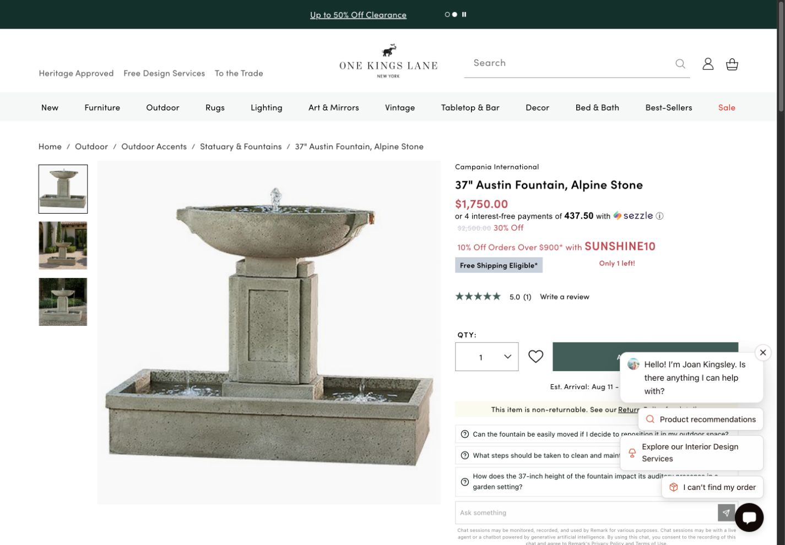
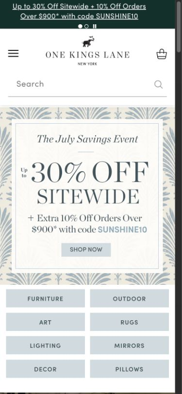
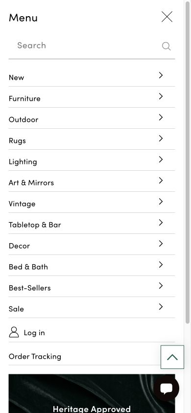
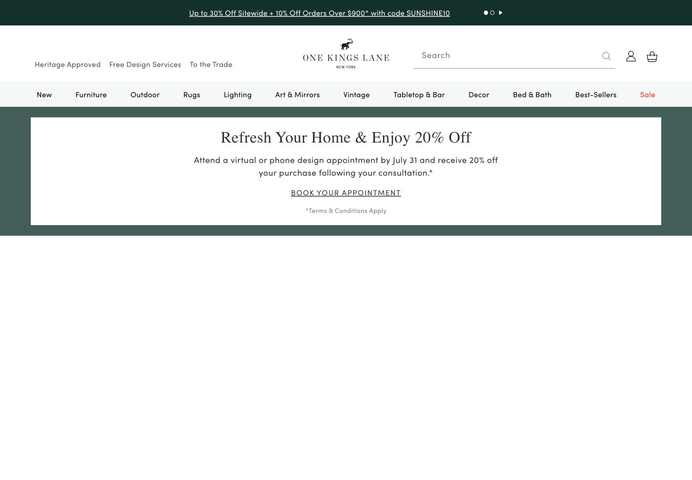

# One Kings Lane Design Audit

Audit date: July 21, 2026  
Scope: Homepage, mobile navigation, furniture collection, product detail, design services, About, trade, and Heritage Approved surfaces.  
Goal: Extract a production-oriented, output-neutral brand system for web, static design, motion design, dimensional work, synthesized imagery/video, and storyboarding.  
Accessibility target: WCAG 2.2 AA where applicable; screenshot review alone cannot certify conformance.

## Executive assessment

The brand has a distinctive foundation: heritage green, editorial serif storytelling, square commerce controls, generous whitespace, room-led photography, and a compelling balance between inspiration and utility. The strongest durable idea is not a particular seasonal palette but **personal style supported by curation and expertise**.

The largest production risks are campaign content becoming mistaken for permanent identity, offer data being hard-coded, public imagery being reused without confirmed rights, text being embedded in campaign images, and persistent overlays obstructing the product decision area.

## 1. Homepage: strong editorial-commerce handoff

Status: **Strong, with campaign portability risk**

The homepage establishes a premium room-led mood, then provides clear paths into product, category, and service content. The deep green utility layer and elephant wordmark are durable signals. The current powder-blue botanical art, summer language, and offer are seasonal and should remain external campaign inputs rather than design tokens.

Recommendation: maintain the room-first hero recipe, but keep offer, campaign palette, hero art, eligibility, and expiration in a separate campaign payload.

## 2. Collection: disciplined product comparison

Status: **Strong**

The collection surface uses a well-separated uppercase title, restrained filters and sorting, square product media, pale neutral grounds, compact powder badges, and red only for sale context. The repeated metadata order supports scanning.

Recommendation: codify a consistent card contract and require badge, price, availability, and promotion states to come from current product data.

## 3. Product detail: clear action, obstructed decision area

Status: **Needs attention**

The product page has a clean gallery/decision split, direct product hierarchy, and a strong square heritage-green primary action. In the captured state, the support overlay obscures part of the decision column. This creates discoverability, readability, and interaction risk precisely where customers need price, variants, and cart controls.

Recommendation: define protected decision-area geometry; support, consent, and promotion layers must avoid it, remain dismissible, and respect compact-screen safe areas.

## 4. Mobile homepage: identity survives, image text needs redundancy

Status: **Good, with accessibility caveat**

The compact header retains menu, logo, search, and cart, and the hero is art-directed for the narrower frame. Some campaign text is embedded in imagery, which makes legibility, localization, responsive cropping, and assistive access harder to guarantee.

Recommendation: all essential campaign copy, offers, and actions should exist as semantic or separately controlled text even when the art also contains lettering.

## 5. Mobile navigation: clear hierarchy

Status: **Strong visual structure; interaction details require functional testing**

The menu exposes primary categories with clear hierarchy and restrained styling. Screenshot inspection cannot confirm keyboard order, focus visibility, screen-reader naming, scroll containment, or submenu behavior.

Recommendation: test all disclosure states with keyboard, screen reader, zoom, and a 44-pixel minimum touch target; preserve access to account and cart while the menu is open.

## 6. Design services: the brand's warm-expertise layer

Status: **Strategically important**

The service surface broadens the brand beyond premium merchandise. The editorial-serif headline, room photography, heritage field, and direct help-oriented language reinforce a credible idea: taste supported by approachable expertise.

Recommendation: include design help as an optional proof or resolution beat in editorial and storyboard recipes, while sourcing service availability, scope, price, and location at runtime.

## Accessibility and usability findings

- Strong visible hierarchy, spacious composition, and generally clear primary actions.
- Test sale red and small tracked uppercase text against their actual backgrounds at final size.
- Do not rely on text baked into campaign imagery.
- Protect product decision areas from overlays.
- Require visible focus, keyboard operation, non-color states, semantic labels, and 44-pixel touch targets.
- Validate responsive crops rather than using one universal image crop.
- Full accessibility review requires functional testing, not screenshots alone.

## System decisions from the audit

- Permanent: “Live Your Style,” elephant identity, heritage green, editorial/interface/reading type separation, square geometry, spacious layouts, room-led imagery, product truth, warm expertise.
- Seasonal: current discount, code, summer campaign, botanical powder-blue artwork, and current outdoor story.
- Inferred but useful: motion timing, dimensional rendering behavior, prompt structures, storyboard schema, and working responsive measurements.
- Excluded: tool-specific framework instructions, provider parameters, hard-coded offers, speculative claims, generic print-production detail, and unverified audio identity.

The Heritage Approved page capture `07-heritage-approved-desktop.png` was rejected as visual evidence because it was incomplete at capture time. The live page and its official assets were reviewed separately, but the failed capture is not used to support visual conclusions.
