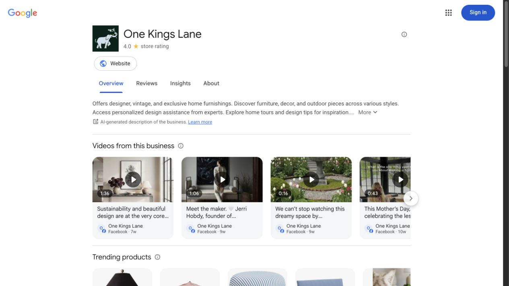
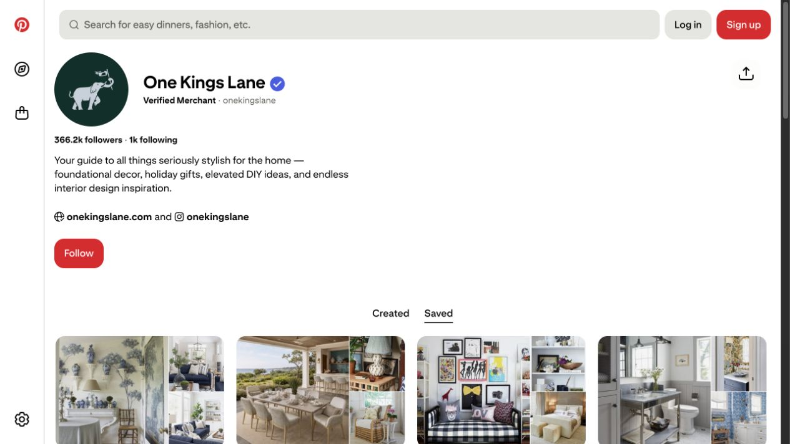
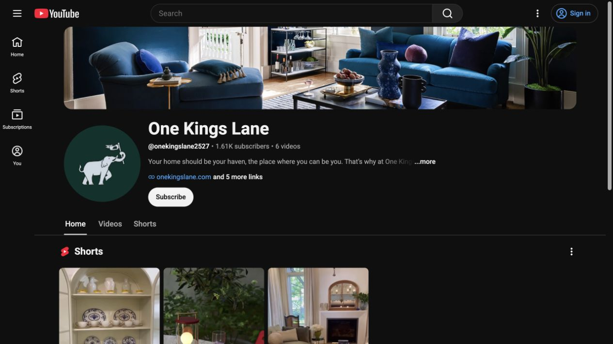
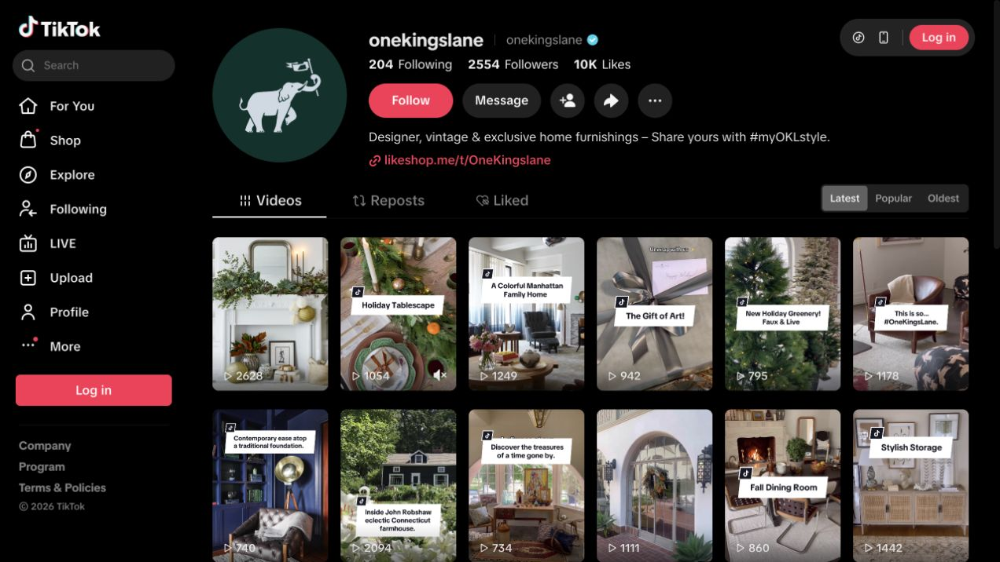
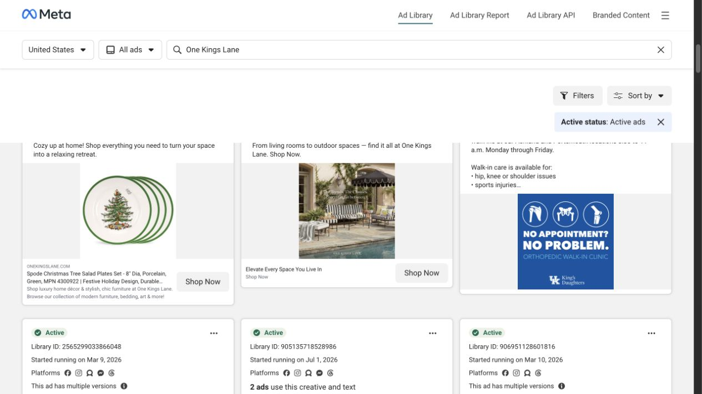

# One Kings Lane Marketing and Social Audit

Audit date: **July 21, 2026**  
Scope: official public social profiles, public advertising-library creative, current public video activity, downloadable public reference media, and rights-governance pages.  
Status: **Evidence complete for the public surfaces listed below; private account data and blocked surfaces remain explicitly unverified.**

This audit is an independent synthesis for internal design-system development. It is not an official One Kings Lane brand manual, campaign report, or grant of asset rights.

## 1. Current Facebook video activity

The public feed snapshot shows several recurring current story types:

- Designer and maker interviews around point of view, sustainability, and craft.
- Product-material proof inside a human story.
- A short creator/room feature built around a named product.
- Seasonal and cultural stories grounded in a real person rather than generic promotion.
- A useful duration range from a compact 16-second commerce story through 43–96-second editorial stories.

Production implication: retain both short commerce and longer maker-story recipes. Derivatives should be cut from a shared fact and rights record, not inferred from a thumbnail.

Source: <https://www.google.com/storepages?c=us&q=onekingslane.com&v=19>

## 2. Pinterest as the inspiration taxonomy

The official verified-merchant profile positions the channel as a guide to foundational decor, holiday gifting, elevated projects, and interior inspiration. The visible boards emphasize complete rooms and material-rich vignettes: blue-and-white rooms, wicker, collected shelving, neutral bedrooms, and patterned baths.

Production implication: use Pinterest for complete 2:3 compositions and discoverable design ideas. The six downloaded board-cover references are useful for room taxonomy and cropping analysis, but are not current post creatives or cleared production assets.

Source: <https://www.pinterest.com/onekingslane/>

## 3. YouTube as a low-volume archive

The channel contains a small visible library of style shorts, product/color arrivals, room inspiration, designer collections, and home tours. The structure is valuable; the visible quantity and age do not support a claim about current publishing cadence.

Production implication: use the channel for format families such as a style note, product arrival, designer collection, and home story. Treat it as archival evidence unless a current content plan is supplied.

Source: <https://www.youtube.com/channel/UCt3uR2lQGK3EjY6U0gntfCw>

## 4. TikTok as a historical vertical execution reference

The visible grid uses 9:16 full-bleed room, product, seasonal, and lifestyle plates with a large white text card, bold black headline, and small channel-native icon. The observed posts are historical profile content rather than evidence of a current short-form program.

Production implication: preserve the direct hook, mobile legibility, and room-first visual behavior. Do not hard-code the large white card as a current brand requirement. Seven poster images are retained as dated internal references with model-upload and redistribution disabled.

Source: <https://www.tiktok.com/@onekingslane>

## 5. Current public Meta advertising creative

Official One Kings Lane cards observed in the active public query include:

- Dynamic catalog/product units with warm general copy, product identity, current price, and a single shop action.
- Room-led brand/collection units using concise ideas such as living your style, a curated home, and selection across rooms.
- A short video collection unit built around the breadth of home needs.
- Cross-placement creative distributed across the Meta surface family.

The keyword result set also contains unrelated advertisers. The screenshot intentionally preserves that limitation; every evidence card must be verified by advertiser attribution. The visible result count is not a One Kings Lane active-ad count.

Production implication: separate durable identity, campaign message, product record, live offer, and destination adaptation. Public ads can establish current creative patterns, but cannot establish performance, spend, targeting, account structure, or a complete inventory.

Sources: <https://www.facebook.com/ads/library/?active_status=active&ad_type=all&country=US&q=One%20Kings%20Lane&search_type=keyword_unordered>, <https://www.facebook.com/help/259468828226154>

## 6. LinkedIn and professional/community marketing

Public profile results show recent design-contest, partnership, press, heritage-platform, and professional-community stories. This supports a trade/community recipe distinct from consumer catalog promotion.

Production implication: treat partners, contest dates, eligibility, participants, judging, results, press attribution, and calls to action as verified job data. The direct page introduced an authentication wall, so this audit does not preserve a direct-page screenshot.

Source: <https://www.linkedin.com/company/one-kings-lane>

## 7. UGC and creator-rights governance

One Kings Lane publishes UGC terms and describes a rights-request/credit process spanning social surfaces. This confirms that creator content is governed content, not free media merely because it is publicly visible.

A production record should require:

1. Original post and creator handle.
2. Permission or applicable rights-grant evidence.
3. Allowed media, edits, channels, term, and geography.
4. Required credit and disclosure.
5. Revocation and expiration state.
6. Approval owner and final asset lineage.

Sources: <https://www.onekingslane.com/ugc-terms>, <https://blog.onekingslane.com/terms-conditions/>

## 8. Coverage limits and required refreshes

- Instagram: official URL verified from the One Kings Lane site; direct public content review was blocked by the platform.
- LinkedIn: current public search evidence reviewed; direct profile introduced an authentication wall.
- Google advertising: an exact advertiser record in the public transparency surface was not verified, so no Google creative pattern is claimed.
- Private advertising accounts: no authenticated Ads Manager, analytics, targeting, spend, conversion, campaign naming, or approval data was accessed.
- Pinterest covers and TikTok posters: internal analysis references only, not production-cleared media.
- Social counts and result counts are intentionally not encoded as durable brand facts.

Refresh the relevant public or authorized source before each campaign, and ingest approved exports through a separate runtime connector rather than placing credentials or performance data in the brand package.

## 9. Design-system changes made from this audit

- Added a tool-neutral `marketing` capability module.
- Added marketing format, safe-area, duration, brief, rights, truth, variant, and lineage guidance.
- Added nine reusable marketing recipes spanning paid, owned, creator, professional, email, site, static, and video work.
- Added official social, ad-library, rights-page, audit-capture, and local-reference records to `media.json`.
- Kept channel evidence dated and separated current creative from historical material.
- Kept private-account configuration, delivery adapters, and performance data outside the design system.
